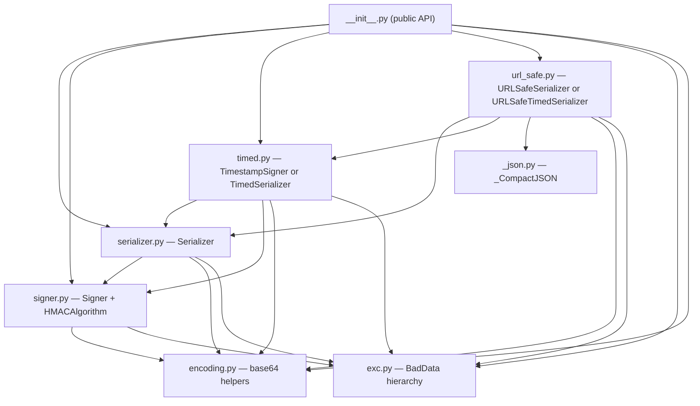
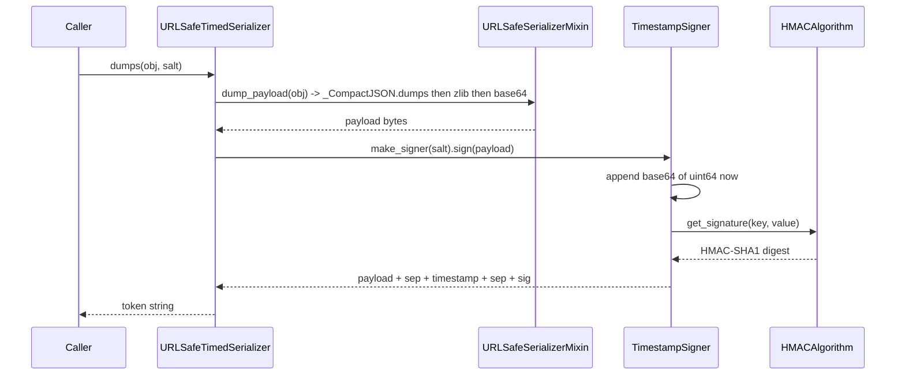
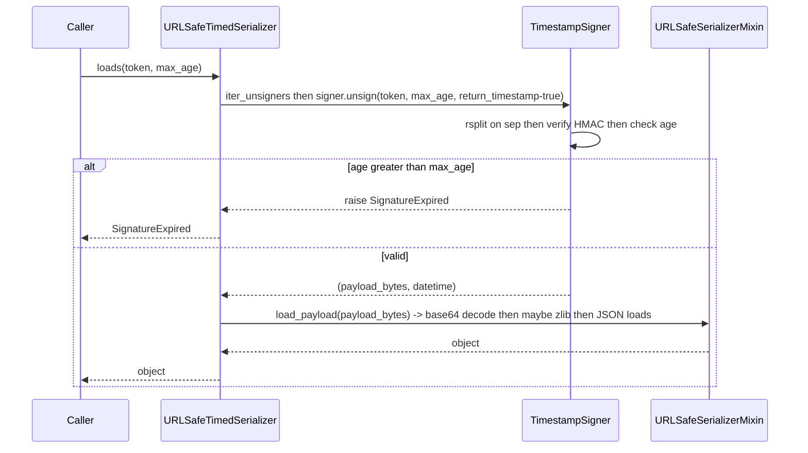
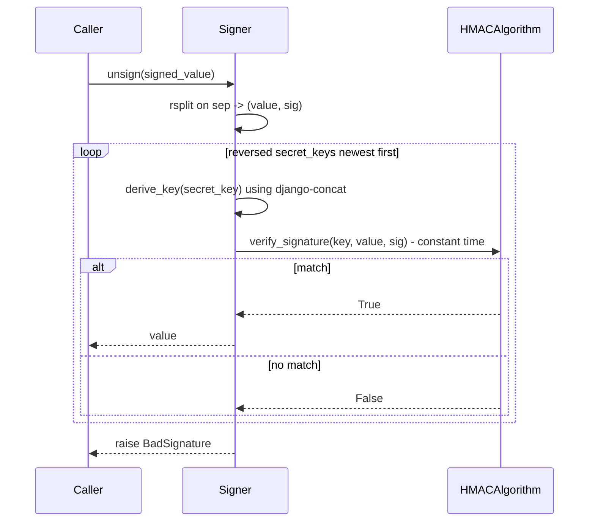
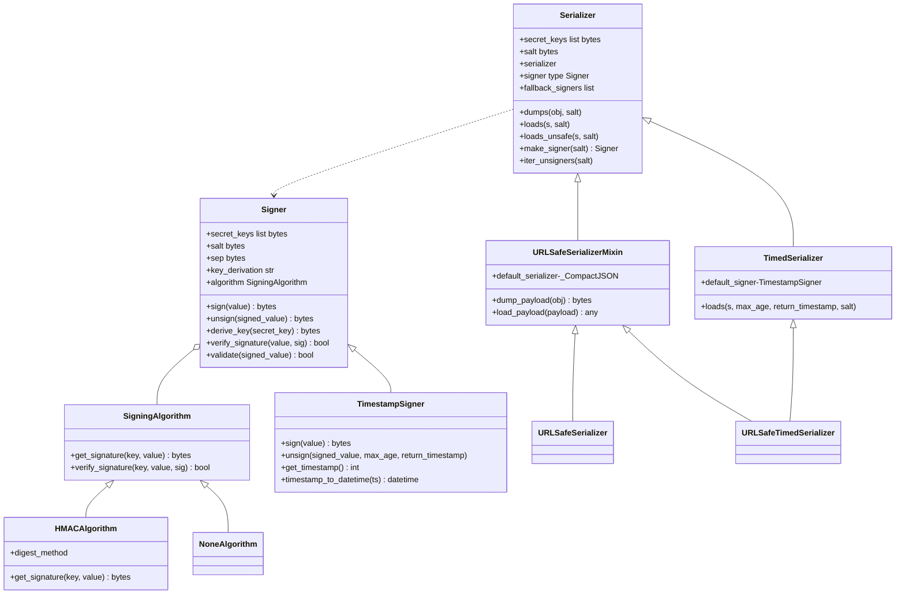
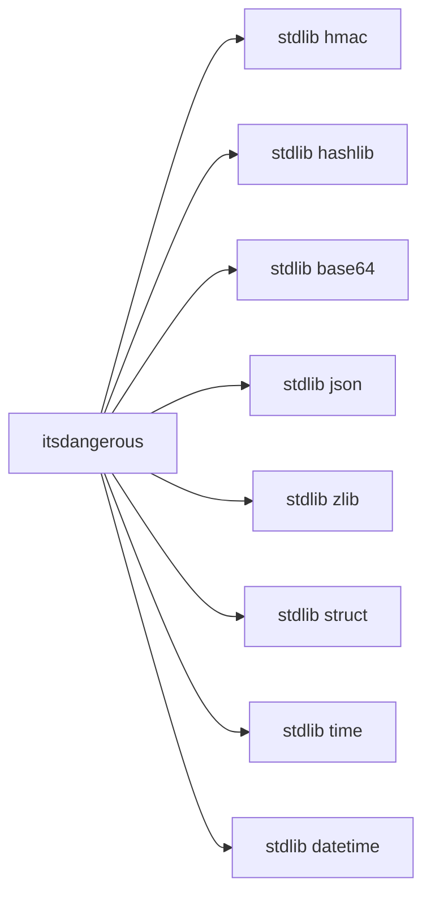

# ARCHITECTURE.md

> ⚠ Mermaid CLI (`mmdc`) not installed — diagrams below were not validated.
> Install with `npm install -g @mermaid-js/mermaid-cli` and re-run `/agent-ready --skip-understand --architecture` to validate.

## 1. Summary

ItsDangerous is a small layered Python library: a public API barrel re-exports a serialization layer that wraps a signing layer. The signing layer composes a pluggable `SigningAlgorithm` (default HMAC-SHA1). Two orthogonal extensions sit on top — a time-aware variant (timestamp + `max_age`) and a URL-safe variant (base64 + optional zlib compression). The whole package depends only on the Python standard library. The dominant style is **layered with mixin composition**.

## 2. Component flowchart

## 3. Sequence diagrams

### 3.1 `URLSafeTimedSerializer.dumps`

### 3.2 `URLSafeTimedSerializer.loads` (happy path)

### 3.3 `Signer.unsign` with key rotation

## 4. Data model

## 5. Dependency graph

## 6. Config table

These are class attributes and constructor parameters; there are no environment variables or runtime config files.

| Name | Default | Where defined | Effect |
|---|---|---|---|
| `Signer.default_digest_method` | lazy SHA-1 | `src/itsdangerous/signer.py:120` | Hash used inside HMAC |
| `Signer.default_key_derivation` | `"django-concat"` | `src/itsdangerous/signer.py:127` | Key-derivation scheme |
| `Signer` `salt` ctor arg | `b"itsdangerous.Signer"` | `src/itsdangerous/signer.py:132` | Context-separator combined with secret |
| `Signer` `sep` ctor arg | `b"."` | `src/itsdangerous/signer.py:133` | Byte separating value from signature |
| `Serializer.default_serializer` | `json` | `src/itsdangerous/serializer.py:95` | Data serializer for `dumps`/`loads` |
| `Serializer.default_signer` | `Signer` | `src/itsdangerous/serializer.py:99` | Signer class used by `make_signer` |
| `Serializer.default_fallback_signers` | `[]` | `src/itsdangerous/serializer.py:104` | Extra signers tried when primary fails |
| `Serializer` `salt` ctor arg | `b"itsdangerous"` | `src/itsdangerous/serializer.py:111` | Salt passed to constructed signer |
| `TimedSerializer.default_signer` | `TimestampSigner` | `src/itsdangerous/timed.py:175` | Time-aware signer |
| `URLSafeSerializerMixin.default_serializer` | `_CompactJSON` | `src/itsdangerous/url_safe.py:21` | Whitespace-stripped JSON |
| `TimestampSigner.unsign` `max_age` | `None` | `src/itsdangerous/timed.py:75` | Reject signatures older than this many seconds |

## 7. Open Questions

1. [NEEDS_CONTEXT]: `pyproject.toml:86` lists `source = ["jinja2", "tests"]` for coverage — is this an intentional cross-project alias or a copy-paste bug that should be `["itsdangerous", "tests"]`?
