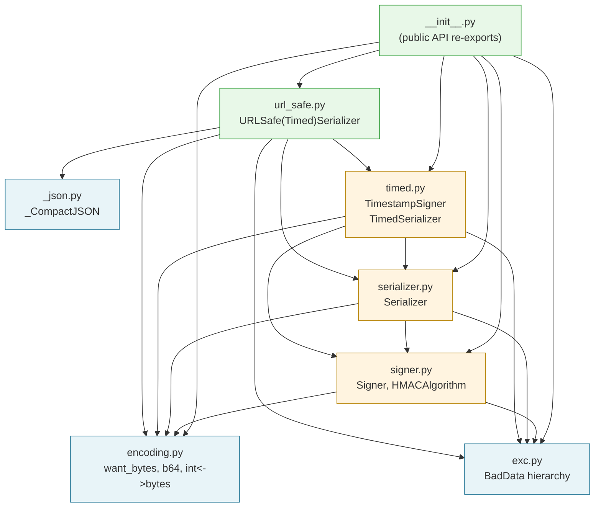
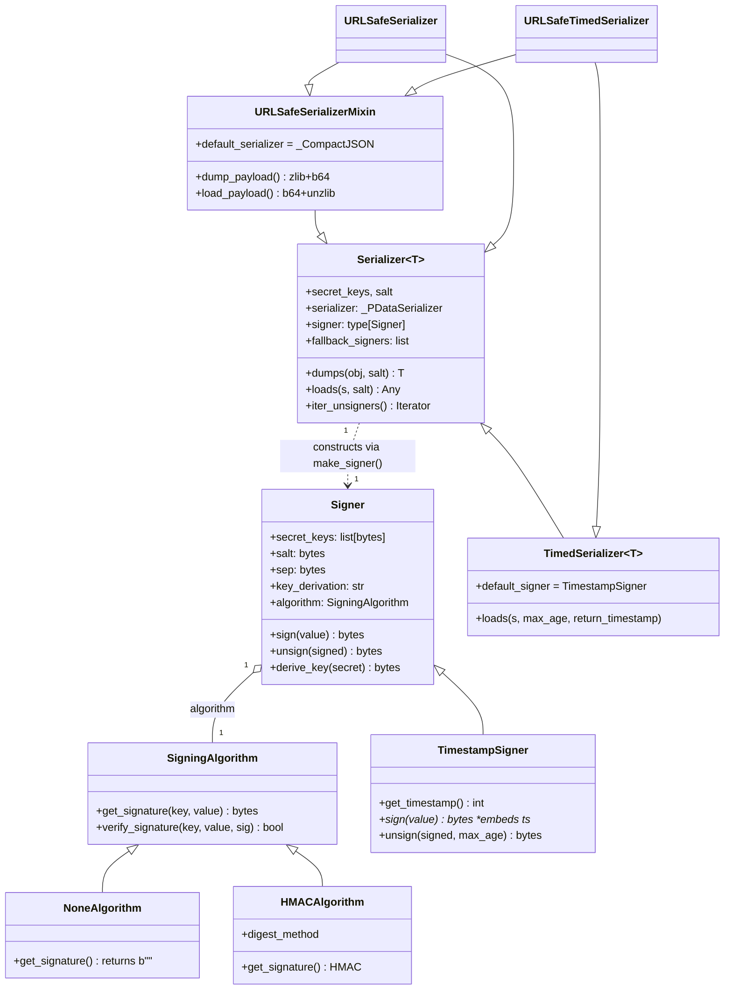
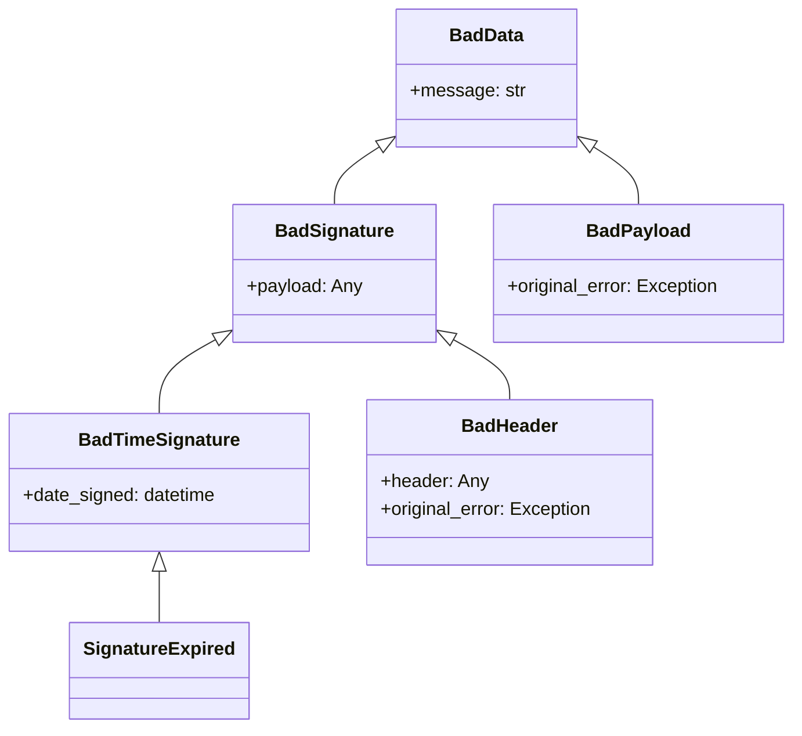
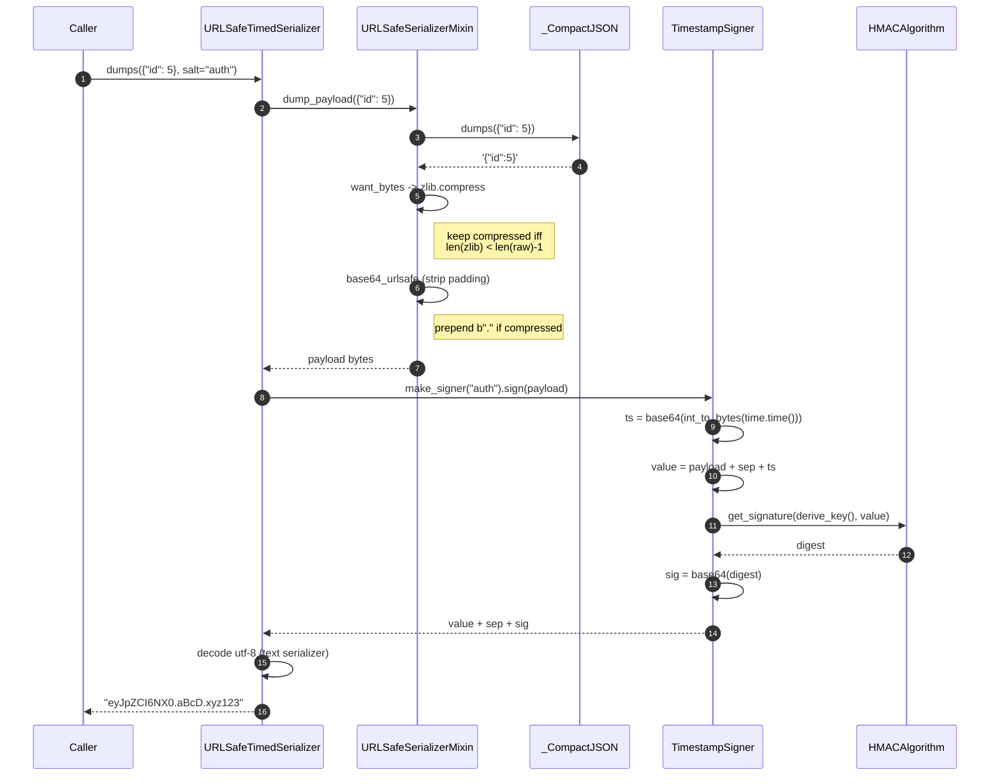
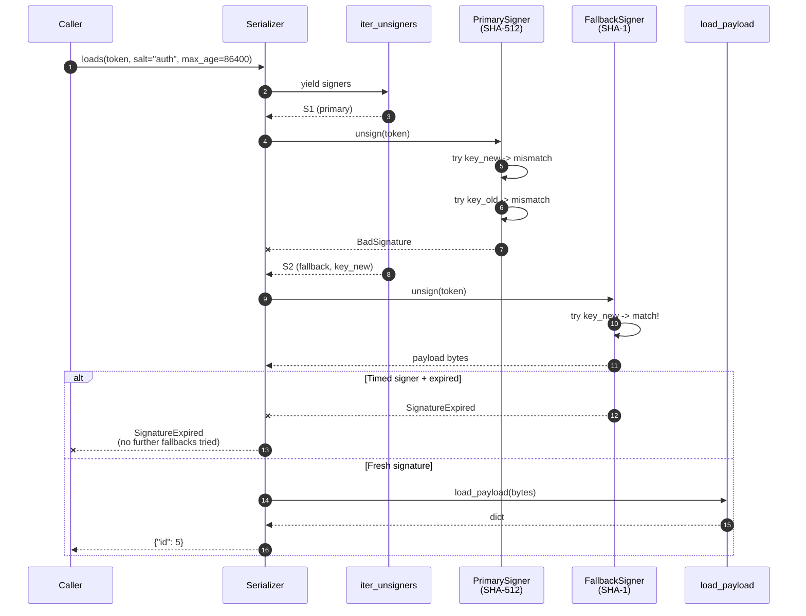
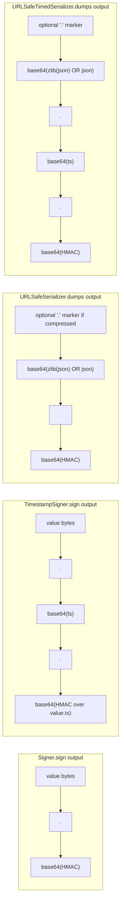
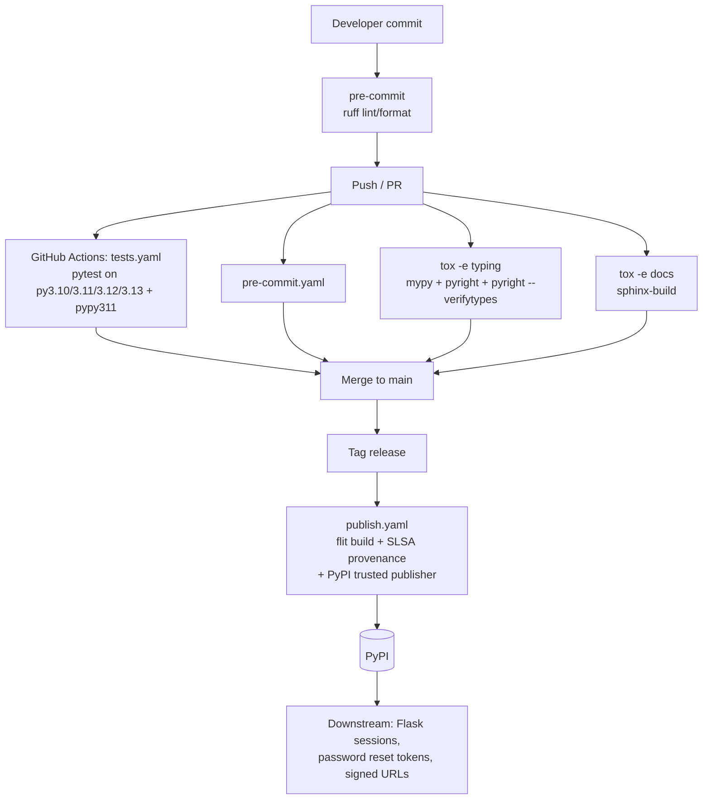
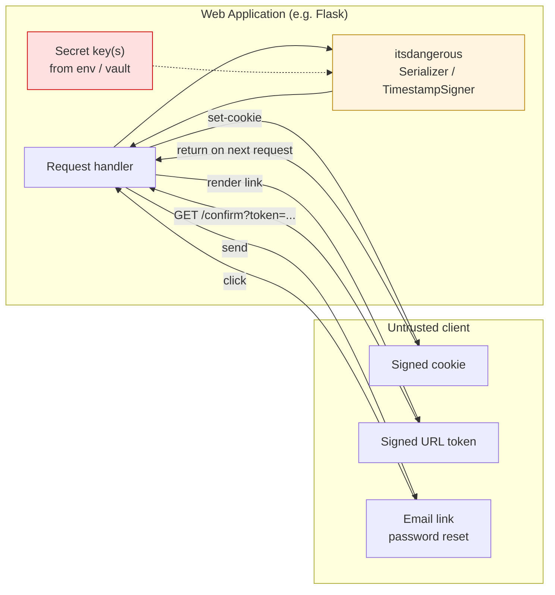

# Architecture: itsdangerous

Diagrams describing the structure and runtime behavior of itsdangerous. All diagrams are Mermaid and render in GitHub, VS Code, and most Markdown viewers.

---

## 1. Module dependency graph

How the package's modules depend on each other. Arrows point from importer to imported.

No cycles. `encoding`, `exc`, `_json` are leaves. `url_safe` is the deepest module.

---

## 2. Class hierarchy

Inheritance relationships across the public types.

---

## 3. Exception hierarchy

Note that `BadPayload` is a sibling of `BadSignature`, not a child — `except BadSignature` will NOT catch `BadPayload`.

---

## 4. Sign flow (URLSafeTimedSerializer.dumps)

End-to-end sequence for the most heavily-stacked path: a URL-safe, timestamped, compressed-JSON signed token.

---

## 5. Unsign flow with fallback signers and key rotation

The most complex runtime path — load a token while a key rotation and an algorithm migration are both in progress.

Key invariants:
- Fallback iteration stops immediately on `SignatureExpired` — the signature was structurally valid, just stale.
- Within one signer, keys are tried newest-first (last in `secret_keys`).
- A primary failure walks to fallbacks; only the LAST `BadSignature` is re-raised.

---

## 6. Token wire format

The on-the-wire string layout for each serializer variant. `.` is the default `sep`.

The leading `.` on URLSafe payloads is a one-byte compression marker. Because `_base64_alphabet` includes `=` and `-_`, the separator must NOT be one of those (validated in `Signer.__init__`).

---

## 7. Build / test / release pipeline

How the project moves from a commit to a published package (from `.github/workflows/` and `pyproject.toml` tox envs).

---

## 8. Component view (C4-ish)

Bird's-eye view of where itsdangerous sits in a typical web application.

The library is a pure-Python building block — it has no network, disk, or process boundary of its own. All trust flows through the secret key.

---

## Validation

Diagrams in this file use only standard Mermaid syntax (flowchart, classDiagram, sequenceDiagram) that renders on GitHub. I did not run a headless mermaid CLI render, but I reviewed each block for syntax (matched subgraph/end, valid arrow types, no unbalanced brackets, no reserved-word participant names).
