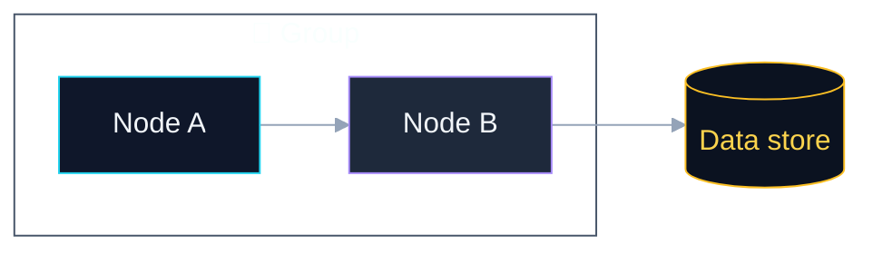
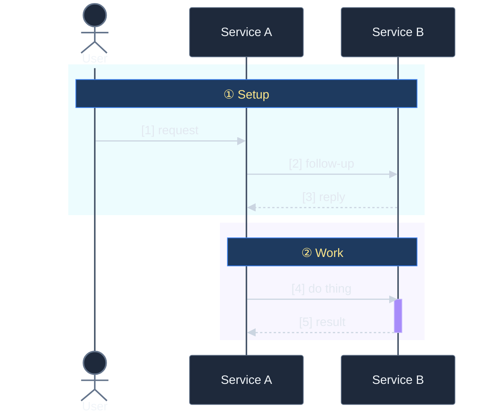

# Mermaid styling defaults

This skill captures the Mermaid renderer rules that took multiple iterations to nail. Apply these BEFORE the first `mermaid_preview` call so the first render is correct, not the fourth.

## The four hard-won rules

1. **`clusterBkg: 'transparent'` must be set EXPLICITLY.** Omitting it falls back to a dark-theme gray default that you can't see in the preview at small zoom but ruins embedded views. Same for `tertiaryColor: 'transparent'` (some sub-renderers use it instead).
2. **`edgeLabelBackground: 'transparent'`** strips the gray pill from edge labels. Without it every label ("based on", "tmp + fsync + rename") gets a contrast-clashing backdrop.
3. **Never set `background:` on `mermaid_preview`** — use `'transparent'` or omit. Let the host page (GitHub, embedded site) provide the canvas. Dark text + transparent SVG renders correctly on any dark-mode host.
4. **No `autonumber` on sequence diagrams in dark theme.** The badge fill is hardcoded to a pale color you can't reach via theme variables — orange/yellow digits on pale cream are unreadable. Use manual `[N]` prefixes inside each message; they inherit `signalTextColor` which you DO control.

## Baseline themeVariables — Flowcharts

Copy this verbatim, then `classDef` per-node colors as needed:

````
%%{init: {'theme':'dark','themeVariables':{
  'primaryColor':'#1e293b',
  'primaryTextColor':'#f1f5f9',
  'primaryBorderColor':'#64748b',
  'lineColor':'#94a3b8',
  'clusterBkg':'transparent',
  'clusterBorder':'#475569',
  'edgeLabelBackground':'transparent',
  'tertiaryColor':'transparent',
  'tertiaryBorderColor':'#475569'
}}}%%
flowchart TB
    A["..."]:::a
    classDef a fill:#0f172a,stroke:#22d3ee,color:#f1f5f9
````

Accent palette to draw from in `classDef`:

- cyan `#22d3ee` — entry / interactive
- purple `#a78bfa` — process / server
- amber `#fbbf24` — data / storage
- emerald `#34d399` — output / sandbox
- pink `#f472b6` — special handler
- slate `#94a3b8` — external / passive (pair with `stroke-dasharray:4 2`)

## Baseline themeVariables — Sequence diagrams

Sequence diagrams have no `classDef` and no per-message styling. The only visual-hierarchy tool is `rect rgba(...)` blocks. Use them.

````
%%{init: {'theme':'dark','themeVariables':{
  'primaryColor':'#1e293b',
  'primaryTextColor':'#f1f5f9',
  'lineColor':'#cbd5e1',
  'actorBkg':'#1e293b',
  'actorBorder':'#64748b',
  'actorTextColor':'#f1f5f9',
  'actorLineColor':'#475569',
  'signalColor':'#cbd5e1',
  'signalTextColor':'#e2e8f0',
  'noteBkgColor':'#1e3a5f',
  'noteTextColor':'#fde68a',
  'noteBorderColor':'#3b82f6',
  'activationBkgColor':'#a78bfa',
  'activationBorderColor':'#c4b5fd',
  'labelBoxBkgColor':'#334155',
  'labelBoxBorderColor':'#94a3b8',
  'labelTextColor':'#fef3c7',
  'loopTextColor':'#fef3c7',
  'messageFontSize':'15px',
  'messageFontWeight':'500'
}}}%%
sequenceDiagram
    actor User
    participant A as Service A
    participant B as Service B

    rect rgba(34, 211, 238, 0.08)
        Note over User,B: ① Phase name
        User->>A: [1] action
        A->>B: [2] follow-up
    end

    rect rgba(167, 139, 250, 0.08)
        Note over A,B: ② Next phase
        A->>B: [3] next action
    end
````

Phase-shade `rgba` palette (always alpha ≤ 0.12 so messages stay legible):

- cyan `rgba(34, 211, 238, 0.08)` — setup / connection
- purple `rgba(167, 139, 250, 0.08)` — staging / processing
- emerald `rgba(52, 211, 153, 0.08)` — live data / steady-state
- amber `rgba(251, 146, 60, 0.10)` — verify / commit
- slate `rgba(148, 163, 184, 0.08)` — teardown

## Preview defaults

When calling `mermaid_preview`:

- `background: 'transparent'` (NOT 'white', NOT a hex value)
- `theme: 'dark'`
- `scale: 3` — the default 2 looks fine in preview but fuzzy on GitHub's resampled view
- `width: 1200–1600` depending on density
- `height`: estimate then bump 10–20%

## What NOT to do

- Don't use `autonumber` on a sequence diagram with a dark theme.
- Don't try `style` or `classDef` on `sequenceDiagram` — silently ignored.
- Don't set `secondaryColor` or `tertiaryColor` to a visible value unless your `classDef` actually uses them. They leak into clusters and labels and cause opaque artifacts.
- Don't use long edge labels in a flowchart. If the node names + arrow direction don't communicate the relationship, your nodes are named wrong.
- Don't use icon shortcodes (`fa:fa-...`) — they need Font Awesome loaded. Use emoji.
- Don't set `clusterBkg` to anything other than `'transparent'` — every other value clashes with at least one host page (GitHub light, GitHub dark, custom dark sites).

## Workflow when generating a Mermaid diagram

1. Pick the diagram type and theme block from above.
2. Draft the diagram source.
3. Call `mermaid_preview` with `background: 'transparent'`, `scale: 3`.
4. Verify the rendered SVG — grep the live file for `cluster rect{fill:transparent` and `edgeLabel{background-color:transparent`. If either is missing, the theme block didn't apply — fix it before showing the user.
   ```bash
   SVG=~/.config/claude-mermaid/live/<preview_id>/diagram.svg
   grep -oE 'cluster rect[^}]*' "$SVG" | head -1
   grep -oE 'edgeLabel[^}]{0,80}' "$SVG" | head -1
   ```
5. Embed the source (not the saved SVG) in the target markdown. GitHub renders Mermaid natively from the fenced code block; saved SVGs go stale.

## Quick-start templates

### Flowchart skeleton

````

````

### Sequence-diagram skeleton

````

````
