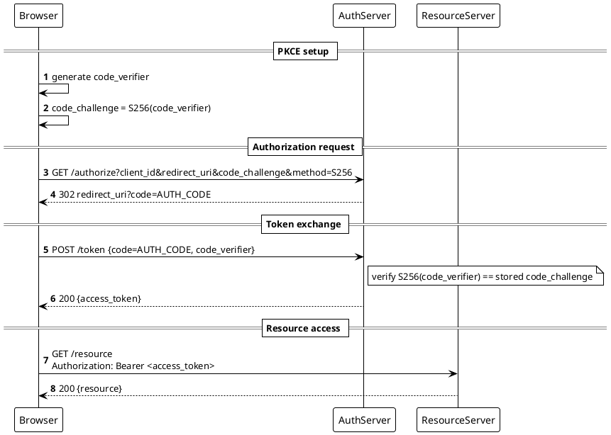

Render: `plantuml -tsvg oauth2-pkce-login.puml`

OAuth2 Authorization Code + PKCE login: Browser generates `code_verifier` and derives `code_challenge`, hits `/authorize` to get an auth code, swaps code + verifier at `/token` for an access token, then calls ResourceServer with `Authorization: Bearer`.
