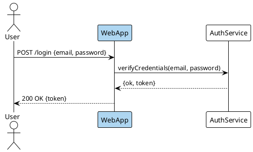

```bash
plantuml -tsvg login-flow-sequence.puml
```

Sequence diagram of a successful login: User -> WebApp -> AuthService and back, with WebApp shaded light blue (#AED6F1) to mark it as the entry point.
