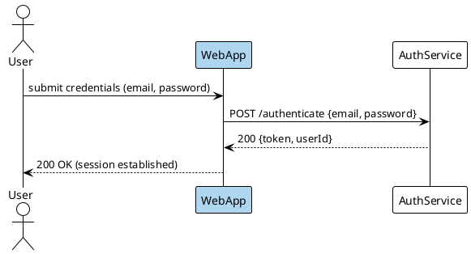

Render: `plantuml -tsvg login-flow-sequence.puml`

Successful login flow: User submits credentials to WebApp (highlighted #AED6F1 as the entry point), which calls AuthService and returns a session token back to the user.
