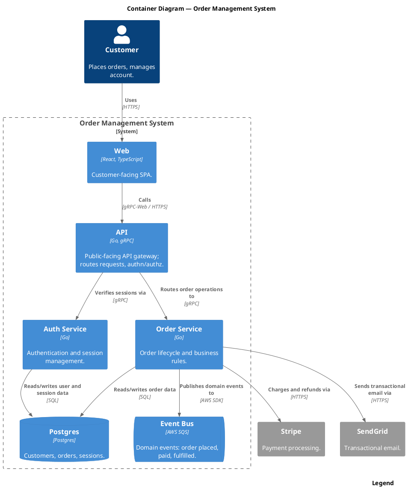

Render: `plantuml -tsvg diagram.puml`

C4 Container view of the Order Management System showing the Customer interacting with the Web SPA, which calls the API gateway that fans out to Order Service and Auth Service over gRPC, both backed by Postgres; the Order Service publishes domain events to an SQS event bus and integrates with Stripe (payments) and SendGrid (email).
