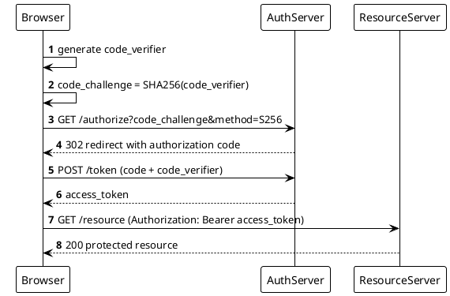

```bash
plantuml -tsvg oauth2-pkce-login.puml
```

Sequence diagram of the OAuth2 PKCE login flow: Browser generates verifier/challenge, exchanges challenge for auth code at AuthServer, swaps code+verifier for an access token, then calls ResourceServer with the token; autonumbered.
