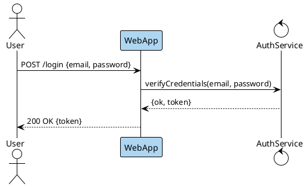

```bash
plantuml -tsvg login-sequence.puml
```

Sequence diagram of a successful login: User posts credentials to WebApp (highlighted light blue as the entry point), which delegates to AuthService and returns a token.
