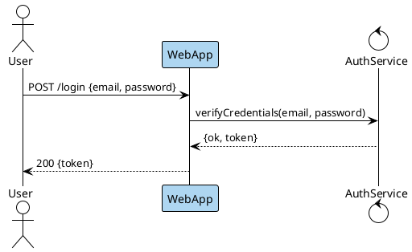

```bash
plantuml -tsvg login-sequence.puml
```

Sequence diagram of a successful login: User to WebApp (highlighted light blue as the entry point) to AuthService and back, returning a token to the user.
