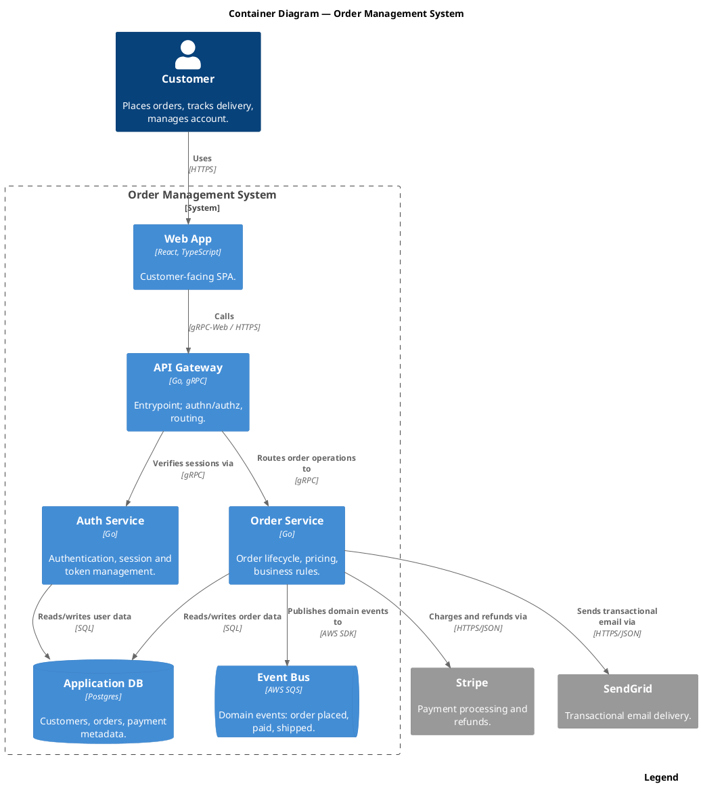

Render: `plantuml -tsvg c4-container-order-management.puml`

Container-level view of the order-management system: the customer reaches a React/TypeScript web app, which calls a Go gRPC API gateway that routes to the Auth and Order services backed by Postgres, with the Order service publishing to SQS and integrating outbound to Stripe and SendGrid.
