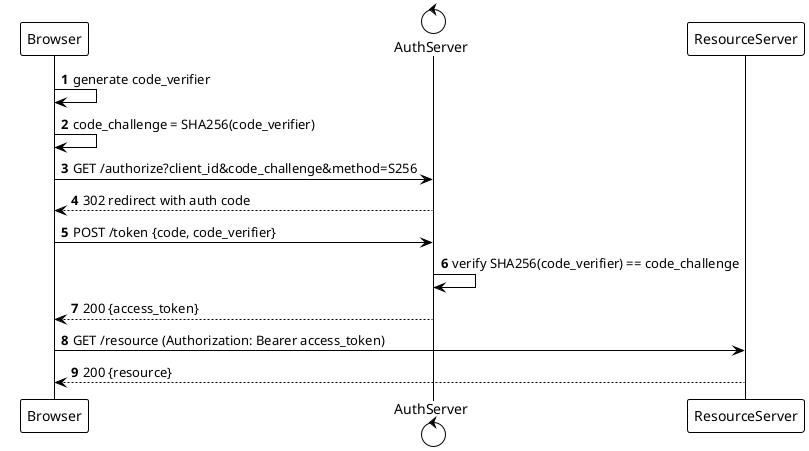

```bash
plantuml -tsvg oauth2-pkce-login.puml
```

Sequence diagram of the OAuth2 PKCE login flow: Browser generates verifier/challenge, requests /authorize, exchanges code + verifier at /token, then calls ResourceServer with the access token, with autonumbering.
