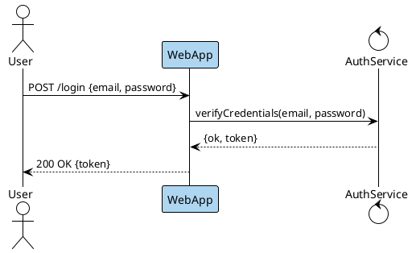

```bash
plantuml -tsvg login-sequence.puml
```

Sequence diagram of a successful login flow: User submits credentials to WebApp (highlighted light-blue as the entry point), WebApp verifies them with AuthService, and a token is returned to the User.
