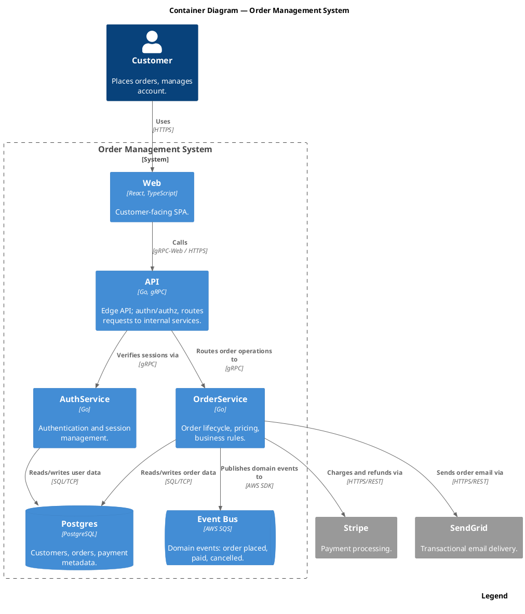

Render: `plantuml -tsvg oms-c4-container.puml`

Container-level view of the Order Management System showing the customer, six internal containers (Web, API, AuthService, OrderService, Postgres, SQS event bus), and two external SaaS dependencies (Stripe, SendGrid) with the protocol on every edge.
