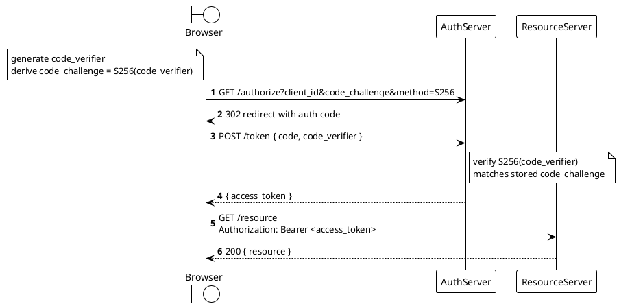

Render: `plantuml -tsvg diagram.puml`

OAuth2 Authorization Code with PKCE login flow: Browser derives `code_challenge` from a locally-generated `code_verifier`, gets an auth code from `AuthServer`, exchanges code plus verifier for an `access_token`, then calls `ResourceServer` as a bearer.
