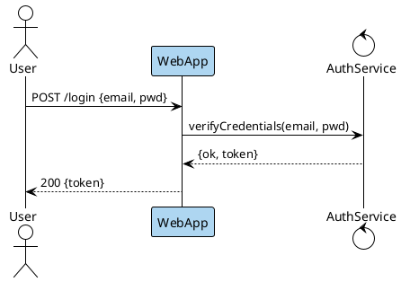

Render: `plantuml -tsvg login-flow.puml`

Successful login flow: User posts credentials to WebApp (highlighted light blue as the entry point), which calls AuthService to verify and returns a token.
