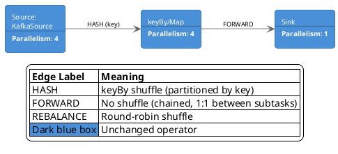

Flink job graph (dashboard-mimicry mode) — KafkaSource (p=4) → keyBy/Map (p=4) → Sink (p=1), rendered with Flink-blue operator boxes and HASH/FORWARD edge labels matching the Flink Web UI.



Render:

```
plantuml -tsvg diagram.puml
```
