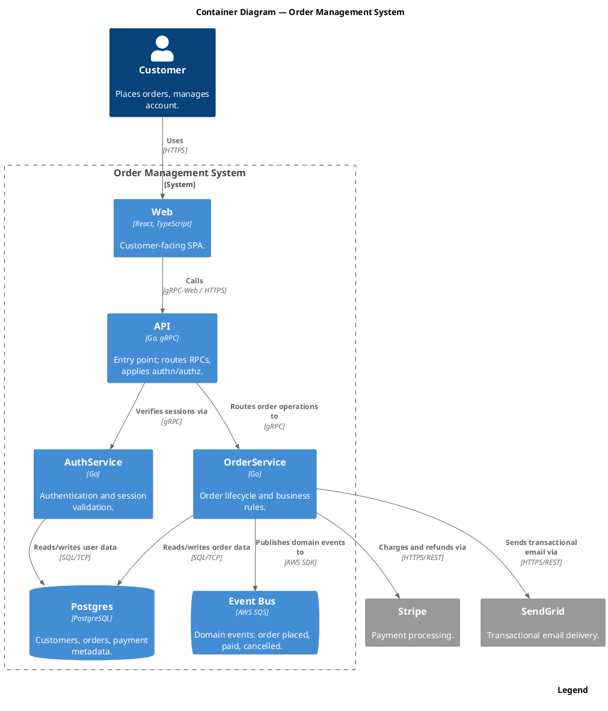

Render: `plantuml -tsvg diagram.puml`

C4 Container view of the order management system, with the Customer as a Person, the six internal containers (Web, API, AuthService, OrderService, Postgres, SQS event bus) inside the system boundary, and Stripe + SendGrid as external systems.
