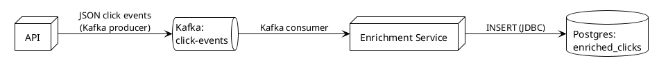

```puml
@startuml clickstream-ingest
!theme plain

left to right direction

node "API" as api
queue "Kafka:\nclick-events" as topic
node "Enrichment Service" as enricher
database "Postgres:\nenriched_clicks" as wh

api      --> topic    : "JSON click events\n(Kafka producer)"
topic    --> enricher : "Kafka consumer"
enricher --> wh       : "INSERT (JDBC)"

@enduml
```

Render: `plantuml -tsvg diagram.puml`

Pipeline diagram showing click events flowing API → Kafka topic → enrichment service → Postgres warehouse table.
