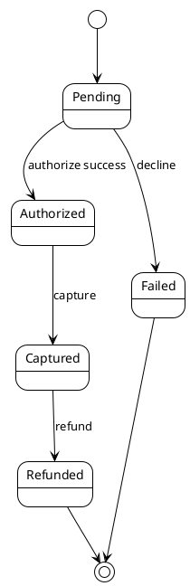

```puml
@startuml payment-state
!theme plain

[*] --> Pending

Pending --> Authorized : authorize success
Pending --> Failed : decline
Authorized --> Captured : capture
Captured --> Refunded : refund

Refunded --> [*]
Failed --> [*]

@enduml
```

Render: `plantuml -tsvg diagram.puml`

Payment lifecycle from Pending through Authorized/Captured/Refunded, with Failed as the decline terminal.
