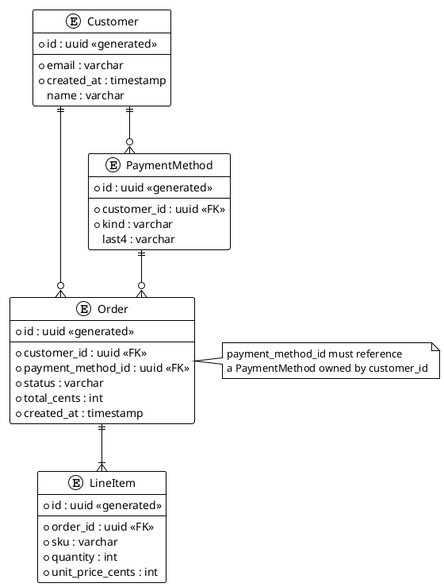

Render: `plantuml -tsvg diagram.puml`

Billing schema with Customer, Order, LineItem, and PaymentMethod, where each Order references both its owning Customer and one of that Customer's PaymentMethods (cross-entity ownership constraint captured as a note).
