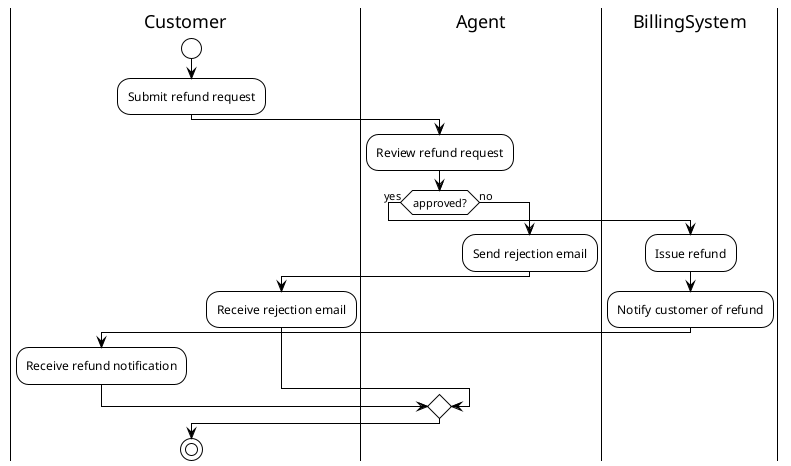

Render: `plantuml -tsvg support-refund-flow.puml`

Activity diagram of the support refund flow across three swimlanes (Customer, Agent, BillingSystem), branching on the agent's approve/reject decision.
