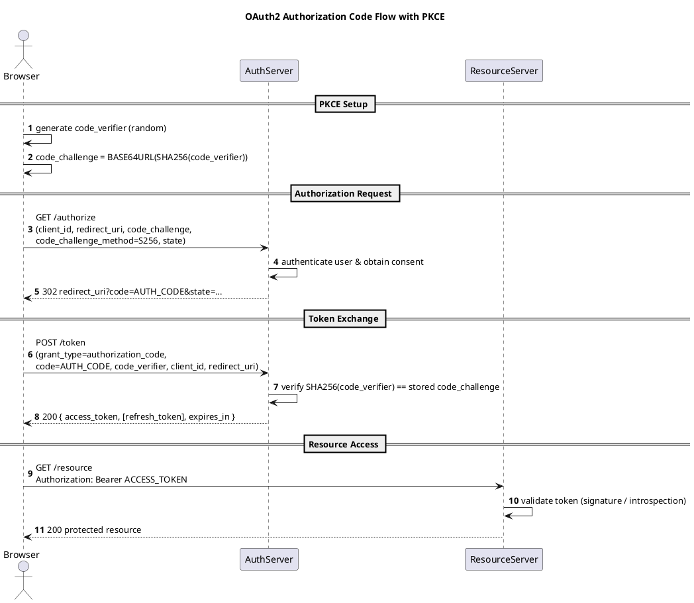

Here's a PlantUML sequence diagram for the OAuth2 Authorization Code flow with PKCE.

Notes:
- `autonumber` numbers every message in order, as requested.
- `code_challenge_method=S256` is the recommended method (RFC 7636); `plain` exists but should be avoided.
- The `state` parameter mitigates CSRF; pair it with `nonce` if you're also using OIDC.
- PKCE removes the need for a client secret, which is why it's the recommended flow for SPAs and native/mobile apps (public clients).
- Render with any PlantUML renderer (e.g. `plantuml diagram.puml`, the VS Code PlantUML extension, or the online server at plantuml.com).
