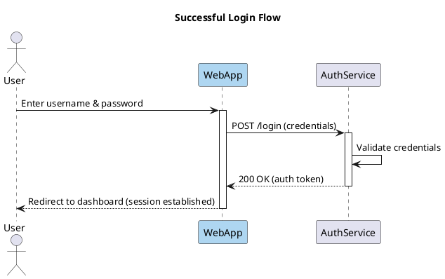

Here's a PlantUML sequence diagram for a successful login flow. The `WebApp` participant is colored light blue (`#AED6F1`) to highlight it as the entry point, while `AuthService` keeps the default styling.

### Notes
- The color is applied inline on the `participant` declaration: `participant "WebApp" as WebApp #AED6F1`. PlantUML accepts hex color codes directly after the participant name.
- `AuthService` has no color suffix, so it renders in PlantUML's default participant style.
- `activate` / `deactivate` show the lifeline activation bars so the request/response timing is clear.
- The self-call on `AuthService` (`Validate credentials`) represents internal credential checking — drop it if you want a strictly two-hop flow.

If you'd like to also style the User actor or add an error branch (invalid credentials, 401), let me know.
