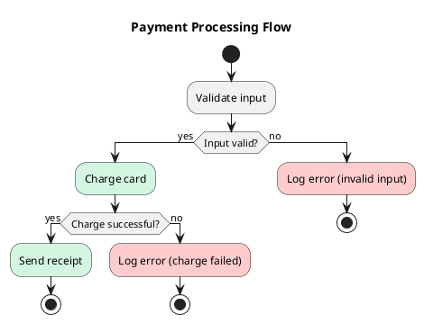

Here's a PlantUML activity diagram using the new (beta) syntax, which supports per-node background colors. The happy-path nodes are tinted `#D5F5E3` (green) and the error nodes `#FFCCCC` (red).



### Notes on the coloring

- Per-activity color is written as `#RRGGBB:Activity label;` — the `#colour` prefix goes *before* the colon, on the same line as the activity.
- I treated "validate input" as a step that can succeed or fail. If it fails, that's also a sad path, so I colored that error red as well. If you'd rather assume validation always succeeds, drop the outer `if` and just keep the charge-card branch.
- I colored "Charge card" green because the green path represents the *successful* charge → receipt flow. If you'd prefer charge card to be neutral (uncolored) and *only* "Send receipt" green, remove the `#D5F5E3:` prefix from `Charge card`.
- The label text ("Send receipt", "Log error") still carries the semantic meaning, so the diagram remains readable in black-and-white — color is reinforcement, not the sole signal, which is what you asked for.

### Rendering

Save as `payment.puml` and render with:

```
plantuml payment.puml          # produces payment.png
plantuml -tsvg payment.puml    # SVG, recommended for docs
```

Or paste into the PlantUML web server / a Confluence PlantUML macro.
