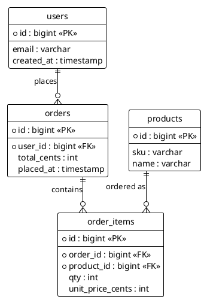

Quick check before I draw — I think the diagram type is mismatched to what you want to show.

- **Sequence diagram** = ordered messages exchanged between participants over time (actors, services, calls/returns). It can't naturally express tables, columns, or foreign keys.
- **What you're describing** (tables, columns, FK relationships) is an **Entity-Relationship Diagram (ERD)**. PlantUML supports this directly. A **class diagram** is the other reasonable option if you want methods/behavior alongside structure.

I'll assume you meant an ERD. Here's a small placeholder so you can see the shape — replace the entities with your real schema and I'll flesh it out.

Saved to `diagram.puml`. To turn this into your real schema, send me either:

1. A DDL dump (`CREATE TABLE ...`), or
2. A list of tables with columns + FK relationships, or
3. A connection-string-less schema export (e.g. `pg_dump --schema-only`).

If you genuinely *did* want a sequence diagram — e.g. "show the SQL calls a service makes against these tables in order" — say the word and I'll redo it as a sequence diagram between the service and the DB instead.
