```puml
@startuml <diagram-name>
!theme plain
...
@enduml
```

# Output contract

The final response after VERIFY has exactly three parts, in this order. Nothing else. No syntax tour, no rationale paragraph.

## 1. The `.puml` source

A single fenced code block, language tag `puml` (or `plantuml`; both render in most viewers):

````

````

The diagram name matches what the file would be called on disk (kebab-case, no extension): `login-sequence`, `auth-container`, `order-state`.

## 2. The render command

```bash
plantuml -tsvg <diagram-name>.puml
```

Default to `-tsvg` (vector, scales, smaller for most diagrams). Mention `-tpng` only if the user specifically wants raster:

```bash
plantuml -tpng <diagram-name>.puml
```

If the user mentions they don't have PlantUML installed, point them at the official online renderer (`https://www.plantuml.com/plantuml/uml/`) or `plantuml.jar` from `plantuml.com`. Don't write installation instructions — that's a separate task.

## 3. One-line summary

A single sentence describing what the diagram shows, written so a reader who only sees the line knows whether to render the diagram. Examples:

> Sequence diagram of the login flow: Browser → API → Auth Service → Users DB and back, with autonumbering.

> C4 container diagram of the order subsystem: Web (React), API (Go), Order Service, Payment Service, Postgres, and external Stripe.

> ER diagram of the billing schema: Customer, Subscription, Invoice, LineItem with crow's-foot cardinality.

Not a summary of the syntax. Not a summary of what's in each box. One sentence about what the *diagram* shows.

## Theme / styling options

Three documented options. Pick one — never invent a fourth (see `references/90-anti-patterns.md` § "Decorative skinparams").

### 1. `!theme plain` — default monochrome

What every template ships with. Use unless the user explicitly opts in elsewhere.

### 2. Colored preset — opt-in, Confluence-friendly

When the user explicitly asks for "colored", "styled", "rich", "Confluence-ready", or "presentation-quality" diagrams, swap `!theme plain` for the canonical preset block in `references/22-styling-colored.md`. Soft-pastel palette, role-based shape colors, shadows + rounded corners. Do **not** apply to C4 diagrams.

### 3. Monochrome fallback — for old PlantUML builds

If the user reports their PlantUML doesn't ship the `plain` theme (older builds, restricted environments), swap the `!theme plain` line for this block:

```puml
skinparam monochrome true
skinparam shadowing false
skinparam defaultFontName "Helvetica"
```

This produces a similar minimal monochrome look without depending on a theme file.

## What NOT to include in the response

- Syntax tutorial. The user can read the `.puml`.
- Decorative section headers around the code block.
- "Let me know if you want changes" — implied, don't say it.
- Multiple alternative versions. Produce one. Iterate if asked.
- Emoji. Not in code, not in prose, not anywhere.
