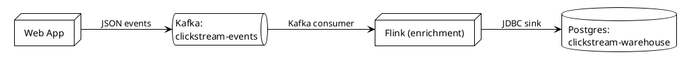

# Pipeline diagrams (data-flow / streaming / "system design")

A horizontally-oriented diagram showing the **stages of a data pipeline**: producers on the left, transports / brokers / processors in the middle, sinks on the right. Use when the user asks for a streaming architecture, Kafka flow, ETL diagram, or "system design" diagram for a data-processing system.

This is a **focused variant of deployment**, not a new PlantUML primitive. No special include — just standard `queue` / `database` / `node` / `cloud` keywords, `left to right direction`, and stage discipline.

## When to pick pipeline vs neighbors

| Prompt | Type |
|---|---|
| "Show how Kafka data flows from API to Postgres" | Pipeline |
| "Draw the streaming architecture for clickstream events" | Pipeline |
| "System-design diagram for our analytics platform" | Pipeline |
| "Diagram our data pipeline / ETL / dataflow" | Pipeline |
| "Show how Flink consumes Kafka" | Pipeline |
| "Sequence diagram for one Kafka message round-trip" | Sequence (one message, time-ordered) |
| "Deployment diagram of our k8s cluster" | Deployment (physical hierarchy) |
| "C4 container diagram of the streaming subsystem" | C4 container (abstraction-first) |

**Pipeline vs deployment**: pipeline shows *stages of a stream* (Producer → Topic → Processor → Sink) reading left to right. Deployment shows *where things run* (cloud → cluster → node → pod) with nesting top-to-bottom. If the user is mainly interested in the flow of data across systems, pick pipeline. If they're mainly interested in the infra topology (which datacenter, which cluster, what's on what host), pick deployment. Both can use the same sprites — the shape of the diagram is what differs.

**Pipeline vs C4-dynamic**: a C4 dynamic diagram numbers steps across containers for one scenario. A pipeline diagram shows the steady-state shape of data flow, not a single scenario. If the user wants ordering / numbered steps, C4-dynamic is better.

## Required elements

Every pipeline diagram has:

1. **`@startuml <name>`** — name reflects the pipeline (`clickstream-ingest`, `payments-stream`).
2. **`left to right direction`** — non-negotiable. The whole point of pipeline is the horizontal-read shape. Vertical pipeline diagrams are unreadable.
3. **At least one source** — typed shape on the left (`queue` for a Kafka topic acting as input, `cloud` for an external producer, `node`/`actor` for a service).
4. **At least one sink** — typed shape on the right (`database` for a warehouse, `cloud` for S3, `queue` for a downstream topic, `node` for a service that consumes).
5. **A processing stage in between** — usually one or more `node`s with descriptive labels ("Flink job", "Spark batch", "transformation lambda"). At least one stage is what makes it a pipeline rather than two boxes shaking hands.
6. **Labeled arrows** — every arrow names the protocol or schema crossing it (`Kafka protocol`, `JSON events`, `Avro records`, `JDBC writes`). The labels are the most-read part of a pipeline diagram.

## Semantic containers — pick the right keyword

| Stage role | Keyword | When |
|---|---|---|
| Producer (external system that publishes events) | `cloud` or `node` | Use `cloud` for external SaaS / third-party producers; `node` for an internally-owned service |
| Stream / topic / broker | `queue` | Kafka topics, Kinesis streams, Pulsar, RabbitMQ |
| Stream processor (stateful) | `node` | Flink, Spark Streaming, Kafka Streams app |
| Batch processor | `node` | Spark batch, Airflow DAG |
| Lookup / state store (read by processor mid-stream) | `database` | Redis, Postgres reference table, feature store |
| Sink (warehouse) | `database` | Snowflake, BigQuery, ClickHouse, Postgres |
| Sink (object store) | `cloud` | S3, GCS, Azure Blob (these are externally-managed) |
| Sink (downstream stream) | `queue` | Output Kafka topic / Kinesis stream |
| Sink (notifications / side-effect) | `node` | Webhook receiver, alerting system |

The default skill rule "no color-only semantics" still applies. Use sprites (see `references/20-sprites.md`) to add technology identity; use labels to convey meaning.

## With sprites (recommended for pipeline diagrams)

Pipeline diagrams are one of the **strongest cases for sprite use** — vendor recognition is the point. Include the sprites from `gilbarbara-plantuml-sprites` (default for streaming/data tech) and attach via `<$<name>>` inside the shape's label:

```puml
@startuml clickstream-pipeline
!theme plain

!define SPRITESURL https://raw.githubusercontent.com/plantuml-stdlib/gilbarbara-plantuml-sprites/v1.1/sprites
!include SPRITESURL/kafka.puml
!include SPRITESURL/apache.puml
!include SPRITESURL/postgresql.puml

left to right direction

node "Web App" as web
queue "<$kafka>\nclickstream-events" as events
node "<$apache>\nFlink (enrichment)" as flink
database "<$postgresql>\nclickstream-warehouse" as wh

web --> events : "JSON events"
events --> flink : "Kafka consumer"
flink --> wh : "JDBC sink"

@enduml
```

See `references/20-sprites.md` for the full sprite catalogue, the Flink gap (use `<$apache>` + "Flink" label), and how to combine with AWS / k8s sprites.

## Without sprites (works everywhere offline)

Same shape, plain monochrome — useful when generated diagrams need to render offline / in a dependency-restricted environment:



This is what the skill produces by default. If the user wants vendor logos, layer the sprite includes back on per `20-sprites.md`.

## Stage discipline

- **One pipeline per diagram.** If there are two distinct streams (e.g., orders pipeline and inventory pipeline), draw two pipeline diagrams. Mixing pipelines crosses concerns and confuses the read order.
- **No more than ~8 stages per pipeline.** Past that the diagram exceeds a single readable horizontal band. If you have 15 stages, split: upstream pipeline + downstream pipeline, with the boundary explicit.
- **Group repeated workers via `collections`.** If the same processor has multiple replicas, use `collections "Workers (N=4)"` instead of drawing 4 identical nodes.
- **Side-effects branch downward, not back.** If a stage writes to a metrics DB or an alert, draw that arrow going *down* from the stage. Pipelines should not have backward arrows (right-to-left); those usually mean the diagram is mis-routed and wants to be a sequence or activity diagram.

## Branching and fan-out

Real pipelines fan out:

```puml
node "<$apache>\nFlink" as flink
database "<$postgresql>\nwarehouse" as wh
cloud "<$amazon-aws>\nS3 archive" as s3
queue "<$kafka>\ndownstream-topic" as out

flink --> wh : "hot path"
flink --> s3 : "archive (raw)"
flink --> out : "enriched events"
```

Multiple sinks coming off one processor is normal pipeline shape. Don't try to draw a single "Sink" box that contains three different things — each downstream is its own node.

## Branching with conditions

Pipelines with conditional routing (e.g., events split by type) are still pipelines, but use note annotations to capture the routing rule — pipeline diagrams aren't activity diagrams and don't have `if/endif`:

```puml
node "router" as router
note bottom of router : routes by event.type:\n— "click" → enrichment\n— "error" → DLQ

queue "enrichment-events" as enr
queue "errors-dlq" as dlq

router --> enr
router --> dlq
```

If the routing logic is complex enough that the annotation grows past 2–3 lines, it's a hint the diagram should be **activity** instead of pipeline.

## Anti-patterns specific to pipeline

- **Top-down layout.** No `left to right direction` → the diagram reads as a deployment tree, not a pipeline. Always include `left to right direction`. (Lint catches this as `W090`.)
- **Generic `node` everywhere.** A pipeline diagram with five identical `node "X"` boxes is information-poor. Use `queue` for streams, `database` for stores, `cloud` for managed external services. (Lint catches this as `W091`.)
- **No labeled arrows.** Pipeline arrows must say *what* crosses them (protocol, schema, batch size, frequency). Unlabeled arrows are the most common pipeline-diagram failure mode.
- **Sequence-y diagrams forced into pipeline.** If the user is describing message ordering for a single message ("user clicks → API → Kafka → consumer → DB"), they want a sequence diagram, not a pipeline. The pipeline diagram is for the steady-state shape, not one specific message's journey.
- **Drawing the infra hierarchy.** "EKS cluster contains worker pods contains Flink containers" — that's a deployment diagram. Pipeline diagrams gloss over where things run and focus on the stages of data movement.

## Template

See `templates/pipeline.puml` for the starter skeleton.

## Cross-references

- Sprite catalogue: `references/20-sprites.md`
- Deployment alternative (when infra hierarchy matters): `references/15-deployment.md`
- C4 alternative (when abstraction level matters): `references/18-c4.md`
- Dashboard-mimicry alternative (when the user wants the *Flink job graph* the way Flink Web UI itself shows it — flat operator boxes with parallelism, HASH/FORWARD/REBALANCE edges): `references/23-dashboard-mimicry.md`. A pipeline diagram is the right answer for "show me the streaming architecture"; a Flink mimicry diagram is the right answer for "show me what the Flink dashboard would show". Don't confuse the two.
- Anti-patterns: `references/90-anti-patterns.md`
