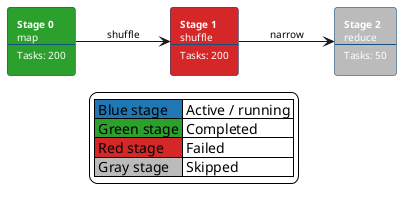
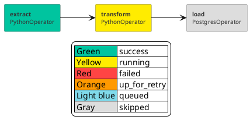
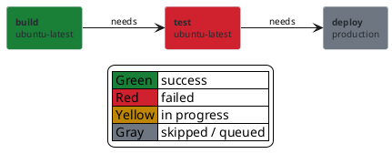

# Dashboard mimicry mode

Some diagrams aren't trying to *redesign* a system's visual — they're trying to *mirror* a tool's existing UI so the reader's brain treats them as continuous with the dashboard they already know. A Flink job graph in a design doc, a Spark stage view in an incident write-up, an Airflow DAG status snapshot in a runbook, a GitHub Actions workflow in a CI deep-dive: in all of these cases, the audience already has a strong mental model from the source tool. Reusing that tool's color language is doing the reader a favor — every box looks the way it would on the screen they actually clicked through last week.

This reference defines the **third sanctioned styling mode**, alongside `!theme plain` (default) and the colored preset in `references/22-styling-colored.md`. It is opt-in, narrow, and rule-bound. It is not a license to color anything however you want.

The whole purpose is to mirror an external tool. If you're not mirroring something specific, this isn't the right mode — use the colored preset (which paints by structural role) or `!theme plain` (which doesn't paint at all).

## When to apply

Apply this mode when the user explicitly references a specific tool's UI — including but not limited to:

- "like the Flink dashboard" / "like the Flink UI shows" / "Flink job graph" in the context of a design doc or runbook
- "like Spark UI" / "Spark stages view" / "Spark DAG"
- "like Airflow shows" / "Airflow DAG view"
- "like GitHub Actions shows" / "Actions workflow graph"
- "match what the actual UI looks like" / "render it like the dashboard"

If the user just says "color-coded job graph" or "colorful pipeline diagram" with no tool reference, that's the colored preset's territory, not this one. When ambiguous, ask:

> Should this match the actual `<tool>` dashboard's color language, or do you want a generic styled diagram?

## What NOT to apply it to

- **Generic component / pipeline / deployment diagrams.** If the user isn't pointing at a specific UI, use the colored preset.
- **C4 diagrams.** C4-PlantUML has its own visual conventions. Use the C4 tag system (`AddElementTag` / `AddRelTag`) instead. See `references/18-c4.md`.
- **DBA-audience ER diagrams.** Crow's-foot notation reads cleaner monochrome.
- **Any diagram where the source tool isn't actually colorful.** Don't invent a palette — if the tool is monochrome, follow it. Mimicry, not embellishment.

## The mandatory legend rule

Dashboard-mimicry diagrams **must** include an inline `legend bottom` block that maps every status color to its meaning. Without the legend:

- The diagram's color is meaningless when rendered monochrome (printer, terminal, color-blind reader).
- Future readers don't know whether `#FF6B6B` means "deprecated", "broken", or "high-traffic".
- The diagram fails the "color-only semantics" check (`references/90-anti-patterns.md`).

With the legend, color becomes a *visual key* anchored by printed text, not a mystery. This is the only thing that makes status coloring legitimate. Diagrams in this mode that omit the legend are anti-pattern.

The legend block goes inside the diagram, not in the surrounding markdown. PlantUML renders it as part of the SVG/PNG, so it travels with the image into Confluence, screenshots, copy-paste, etc.

## Tool palettes

### Flink dashboard

The Apache Flink Web UI renders operators as flat rounded rectangles with a dark-blue base, white text, and a status-driven accent for operators the author wants to highlight (problem operator, new operator, modified operator). Edges are labeled with the shuffle type (`HASH (key)`, `FORWARD`, `REBALANCE`).

Canonical preset:

```puml
@startuml flink-jobgraph-name
left to right direction
skinparam backgroundColor white
skinparam defaultFontSize 10
skinparam rectangle {
  BackgroundColor #4A90D9
  FontColor white
  BorderColor #2C5F8A
  RoundCorner 8
  Shadowing false
}
skinparam arrow {
  Color #666666
  FontSize 9
}

' Operators — base color (Flink blue) for unchanged operators
rectangle "Source:\nKafkaSource\n---\n**Parallelism: 3**" as SRC
rectangle "Map:\nMapFunction\n---\n**Parallelism: 6**" as MAP

' Use inline overrides for status:
'   #FF6B6B   = problem / racy / broken           (Flink red accent)
'   #4ECDC4   = new operator / new emit semantics (Flink teal accent)
'   #96CEB4   = modified additively               (Flink pale-green)
'   #45B7D1   = secondary blue (use sparingly)
rectangle "**RacyOperator**\n(keyBy id)\n---\n**Parallelism: 6**" as RACY #FF6B6B

' Edges — name the shuffle (HASH / FORWARD / REBALANCE)
SRC --> MAP : REBALANCE
MAP --> RACY : HASH (id)

legend bottom
  |= Edge Label |= Meaning |
  | HASH | keyBy shuffle (partitioned by key) |
  | FORWARD | No shuffle (chained operators) |
  | REBALANCE | Round-robin shuffle |
  |<#FF6B6B> Red box | Problem / racy operator |
  |<#4ECDC4> Teal box | New operator |
  |<#96CEB4> Pale green box | Modified (additive change) |
  |<#4A90D9> Dark blue box | Unchanged operator |
endlegend

@enduml
```

The base color is non-negotiable — the whole point is dashboard parity. Edge labels must name the shuffle type; that's how Flink itself labels them.

### Spark UI (DAG / stages view)

Spark colors stages by status: blue for active, green for completed, red for failed, gray for skipped. Stage rectangles are typically narrower than Flink operator boxes, with the stage ID prominent.

Canonical preset:

### Airflow DAG view

Airflow colors task instances by state: green (success), red (failed), yellow (running), orange (up_for_retry), gray (skipped), light blue (queued). Tasks are rectangles with the task name and operator type.

Canonical preset:

### GitHub Actions workflow graph

Actions colors job nodes by check status: green check (success), red x (failed), yellow dot (in progress), gray (skipped/queued).

Canonical preset:

## Ordering rules

- This mode replaces both `!theme plain` and the colored preset. Don't stack them.
- The `skinparam rectangle { ... }` block is the canonical base — copy verbatim from the relevant tool above. Per-shape overrides (`as RACY #FF6B6B`) carry status meaning, paired with the legend.
- Edge labels are part of the mimicry — use the source tool's vocabulary (`HASH`, `FORWARD`, `REBALANCE` for Flink; `shuffle`, `narrow` for Spark; `needs` for GHA).
- The `legend bottom` block is the last non-`@enduml` directive in the diagram.

## What stays banned

The "color-only semantics" rule is **not** dropped — it's redirected. The legend block is what carries the meaning; color is the visual amplifier. If you remove the legend and rely on red-means-bad alone, you're back to the anti-pattern. The legend is load-bearing.

This also means: don't invent new status colors that aren't in the canonical preset for the tool. If the source UI has four states, use those four. Adding "yellow means kinda-deprecated" creates a private dialect the reader won't recognize.

## Inline highlights vs. status colors

A single highlight on a non-status diagram (one component the diagram is about) doesn't need a legend — it's a one-off pointer, not a system. Continue using the inline-override pattern from `references/22-styling-colored.md` for that case.

The legend rule applies specifically when you're using color as a **vocabulary** (multiple operators, each colored by status). One-shape highlights are different: they read as "look here", which the reader gets without a key.

## Lint behavior

`scripts/lint.py` checks for the legend when a diagram looks like dashboard-mimicry mode (multiple inline color overrides on the same shape type). Specifically: if a `.puml` file has 2+ rectangles with hex-color suffixes and no `legend` block, the linter emits `W023` ("dashboard-mimicry without legend") as a warning. The warning doesn't block emit, but the prose VERIFY pass should fix it before shipping.

## Render note

The presets above use only hex colors and the standard `skinparam rectangle` block — no shadowing, no stdlib includes, no version-specific features. They render identically across PlantUML versions back to ~v1.2018; older versions ignore `RoundCorner` (rectangles render with sharp corners) but everything else stays sensible.
